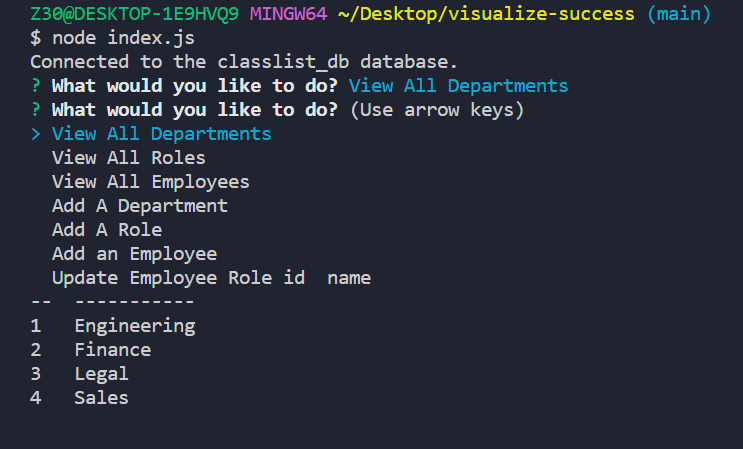
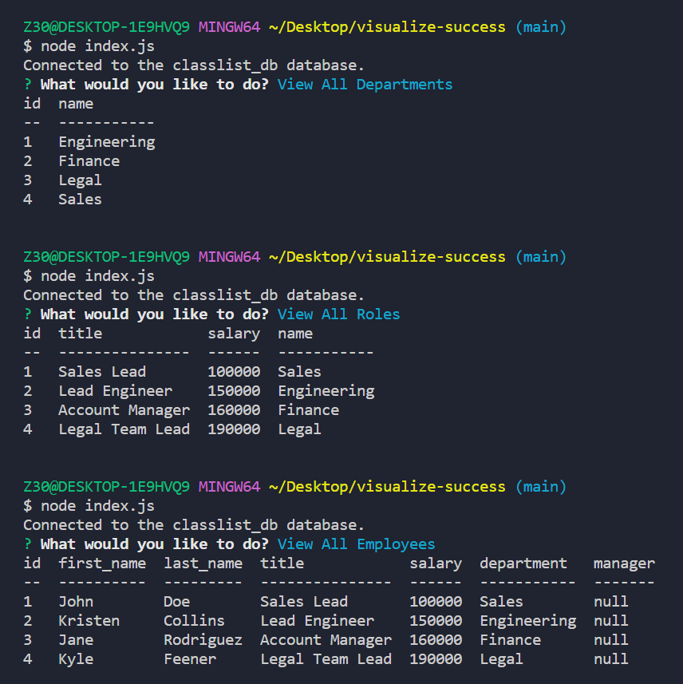

# Visualize Success

## Description

Even if there are hundreds of members on a team of developers, they all have one common goal: create an application that's successful. In order to do so, you must start at the very base of your success pyramid, your team. With Visual Success, you're able to see your departments, roles, and employess, and you may also edit any of the displayed information.

## Installation

To ensure you're able to use the application properly, ensure you have MYSQL and Node.js downloaded on your computer.
Once everything is downloaded, open your code editor, and update the db mysql connection password to your own in the index.js file.

Make sure these npm packages are installed:

- mysql2  ```npm i mysql2```
- inquirer  ```npm i inquirer```
- console.table ```npm i console.table```

Lastly, to run your application, type ```node index.js``` in the command line.

## Bugs

After making each selection, the menu does not restart. There were problems with a double menu and console.table not working properly when the restart menu was coded, so after each selection, you must exit the application using "CTRL + C", and re-initiate it with ```node index.js```



## Usage

In your application, you're able to view all departments, role, and employees



You may also add an employee and update any of your employees roles.

## Link

<a href = "https://drive.google.com/file/d/1xoiTE7qb0sPpUUCX2OTJQ2seQkzWEAjZ/view">Walkthrough Visualize Success: Employee Tracker</a>